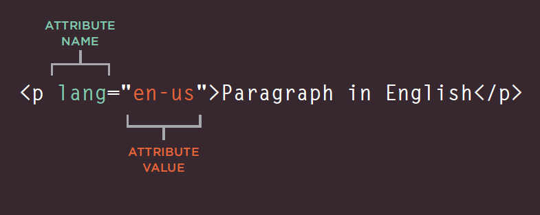

# Class 1 reading

## Duckett HTML book Chapter 1 : Structure

HTML uses elements to describe the structure of pages. and each element made up of two tags:
* An opening Tag.
* A closing Tag.

Any HTML code should be between HTML element : <HTML> The code is written here </HTML>

We have many elements such as **H1** (heading) and **p** (paragraph), they both can be used for text, the main difference between them is the **importance**.

Attributes provide additional information about the contents of an element, and they are made of two parts: A name and a value, seperated by an equal sign:

 

HTML code consists of two main parts:
1. The head ; contains the title of the WebPage, the css internal stylling, and the linking sentence for other files.

2. the body; which I will write here my WebPage structure code.

----

## Duckett HTML book Chapter 8 : Extra Markup

We can use **DOCTYPE** decleration to tell a browser which type of HTML the page is using.

We can add **comments** in HTML pages and it will not be visible in the user's browser by:
`<!-- your comment here -->` 

**ID Attribute** is used to uniquely identify that element from other elements on the page, it's a value should start with a letter or an underscore. **ID** attribute known as global attribute because it can be used in any element:

`
 ....... 
`

**Class attribute** identifying several elements as being different from the other elements on the page:

`
.......
`

**Block elements** appear to start on a new line in the browser window, such as:
`<h1> / 
 / <ul>/ <li>`

**Inline elements** continue in the same line as their neighboring elements, such as:
`<a> / <em> / <b> / `

----

## Duckett HTML book Chapter 17 : HTML5 Layout

