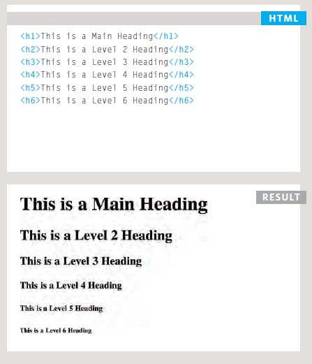
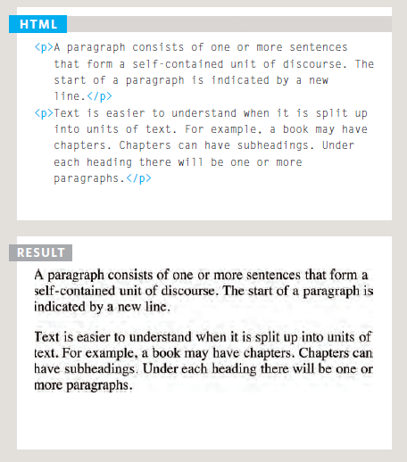
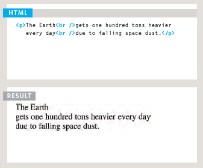
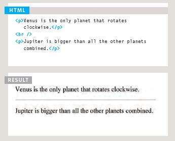
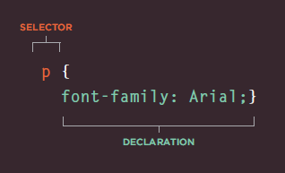
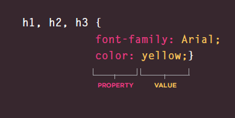

# Class-02 reading

## Duckett HTML book Chapter 2 : Text

### HTML elements are used t XX o describe the structure of the page.

### Headings

HTML has six "levels" of headings:
**<h1>** is used for main headings

**<h2>** is used for subheadings

If there are further sections under the subheadings then the **<h3>** element is used, and so on...

### Paragraphs

To create a paragraph, surround the words that make up the paragraph with an opening **
** tag and closing **
** tag.
By default, a browser will show each paragraph on a new line with some space between it and any subsequent paragraphs.

### Bold & Italic

By enclosing words in the tags **<b>** and **</b>** we can make characters appear bold.

By enclosing words in the tags **<i>** and **</i>** we can make characters appear italic.

### Line Breaks & Horizontal Rules

If you want to add a line break inside the middle of a paragraph you can use the line break tag ** **.

To create a break between themes — such as a change of topic in a book or a new scene in a play — you can add a horizontal rule between sections using the **
** tag

----

## Duckett HTML book Chapter 10 : Introducing CSS

CSS allows you to create rules that specify how the content of an element should appear. For example, you can specify that the background of the page is cream, all paragraphs should appear in gray using the Arial typeface, or that all level one headings should be in a blue, italic, Times typeface.

CSS works by associating rules with HTML elements. These rules govern how the content of specified elements should be displayed. A CSS rule contains two parts: a selector and a declaration.

CSS declarations sit inside curly brackets and each is made up of two parts: a property and a value, separated by a colon. You can specify several properties in one declaration, each separated by a semi-colon.

We can use css features in HTML structure by three ways:

1. **Using External CSS**; by linking the HTML file in the head session using the following code:
`<link href="css/styles.css" type="text/css"rel="stylesheet" />`.

1. **Using Internal CSS**; by adding `<style>` tags inside the head session and writing **css** code in it.

2. **Inline CSS**; by writing the style feature in the same line of HTML code.

