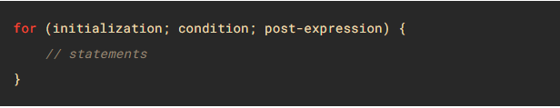

# Class-03 reading

## Duckett HTML book Chapter 3 : Lists

There are lots of occasions when we need to use lists. HTML provides us with three different types:

* **Ordered lists** are lists where each item in the list is numbered. For example, the list might be a set of steps for a recipe that must be performed in order, or a legal contract where each point needs to be identified by a section number. 
The ordered list is created with the `<ol>` element.
Each item in the list is placed between an opening `<li>` tag and a closing `</li>` tag.


* **Unordered** lists are lists that begin with a bullet point (rather than characters that indicate order).
The unordered list is created with the `<ul>` element.
Each item in the list is placed between an opening `<li>` tag and a closing `</li>` tag.


* **Definition** lists are made up of a set of terms along with the definitions for each of those terms.

----

## Duckett HTML book Chapter 13 : Boxes

#### Box Dimensions: Width,height

By default a box is sized just big
enough to hold its contents. To
set your own dimensions for a
box you can use the height and
width properties.
The most popular ways to
specify the size of a box are
to use pixels, percentages, or
ems. Traditionally, pixels have
been the most popular method
because they allow designers to
accurately control their size.
When you use percentages,
the size of the box is relative to
the size of the browser window
or, if the box is encased within
another box, it is a percentage of
the size of the containing box.
When you use ems, the size
of the box is based on the size
of text within it. Designers
have recently started to use
percentages and ems more for
measurements as they try to
create designs that are flexible
across devices which have
different-sized screens.

Every box has three available properties that
can be adjusted to control its appearance:
1. Border
2. Margin
3. Padding


### Limiting Width: min-width, max-width

Some page designs expand and
shrink to fit the size of the user's
screen. In such designs, the
min-width property specifies
the smallest size a box can be
displayed at when the browser
window is narrow, and the
max-width property indicates
the maximum width a box can
stretch to when the browser
window is wide.

### Limiting Height: min-height, max-height

In the same way that you might
want to limit the width of a box
on a page, you may also want
to limit the height of it. This is
achieved using the min-height
and max-height properties.

### Overflowing Content: overflow

The overflow property tells the
browser what to do if the content
contained within a box is larger
than the box itself. It can have
one of two values:
* hidden
* scroll


### Border Width: border-width

The border-width property
is used to control the width
of a border. The value of this
property can either be given
in pixels or using one of the
following values:
* thin
* medium
* thick


----

## Duckett JavaScript book Chapter 4 : Decisions and Loops

### For loob

The JavaScript `for` loop statement allows you to create a loop with three optional expressions. The following illustrates the syntax of the `for` loop statement:



### * initialization
The initialization expression initializes the loop. The initialization expression is executed only once when the loop starts. You typically use the initialization is to initialize a counter variable. If you use the var keyword to declare the counter variable, the variable will have either function or global scope. In other words, you can reference the counter variable after the loop ends. However, if you use the let keyword to declare the counter variable, the variable will have a blocked scope, which is only accessible inside the loop.

### * condition
The condition is an expression that is evaluated once before every iteration. The statement inside the loop is executed only when the condition evaluates to true. The loop is terminated if the condition evaluates to false. Note that the condition is optional. If you omit it, the for loop statement considers it as true.

### * Update 

----

### While loop

The **while** loop loops through a block of code as long as a specified condition is true.

```
while (Condition) {
  // code block to be executed
}
```
 ----


